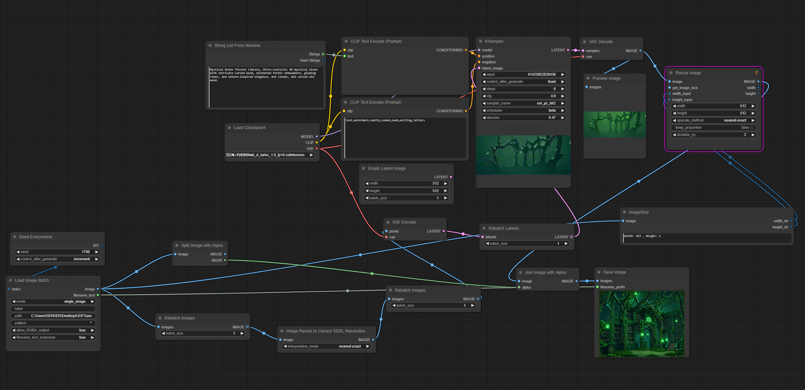

# Green Thicket Library GUMPS

**Custom Gumps for The Green Thicket Library on UOForever Ultima Online Server**

These custom gumps were created for fun and to enhance the experience at the Green Thicket Library, run by Ahjuna on the UOForever Ultima Online server.

## Installation Instructions

1. **Download and Extract:**
   - Download the repository.
   - Extract the contents into the following directory:  
     `C:\Program Files (x86)\UOForever\UO\`

2. **To Remove:**
   - If you wish to remove the custom gumps, simply delete the images from the same folder and restart UO.

This will replace your in-game gumps with custom "Green Thicket Library" versions!

## Image Creation

All images were created using **ComfyUI**, an open-source framework for working with the latest and best Neural Network AI models from industry leaders like OpenAI, Meta, Hugging Face, and more.

Anyone with a good Nvidia GPU (1080 or higher) can do this for free!  
[ComfyUI Installation Guide](https://github.com/comfyanonymous/ComfyUI?tab=readme-ov-file#installing)  
[ComfyUI-Manager on GitHub](https://github.com/ltdrdata/ComfyUI-Manager)

### Image Resizing Process

Since most image models require a preset size (typically 512x512 or larger) and most of the UO artwork is much smaller, we need to upscale the images to the closest SDXL resolution, process them through the sampler, and then resize the output back to the correct dimensions.

The alpha channel is preserved, so all images will retain their original dimensions.

## Workflow Flexibility

With the current workflow in place, we can generate a new set of gumps for virtually anything! By simply passing all our gump art through a new set of keywords, we can produce brand new outputs.

The `GreenThicketLibraryGUMPSWorkflow` contains the ComfyUI workflow that anyone can use on their own PC with ComfyUI Portable. Just drag the workflow file onto the ComfyUI Web Interface, and you’re all set!

## Screenshots

### Green Thicket Library Gumps

### ComfyUI Workflow

## Tools Used

I used **UOFiddler**, a free open-source software available on GitHub, to export the current gump set from the shard I’m currently on.

https://imgur.com/a/X9N1sKG